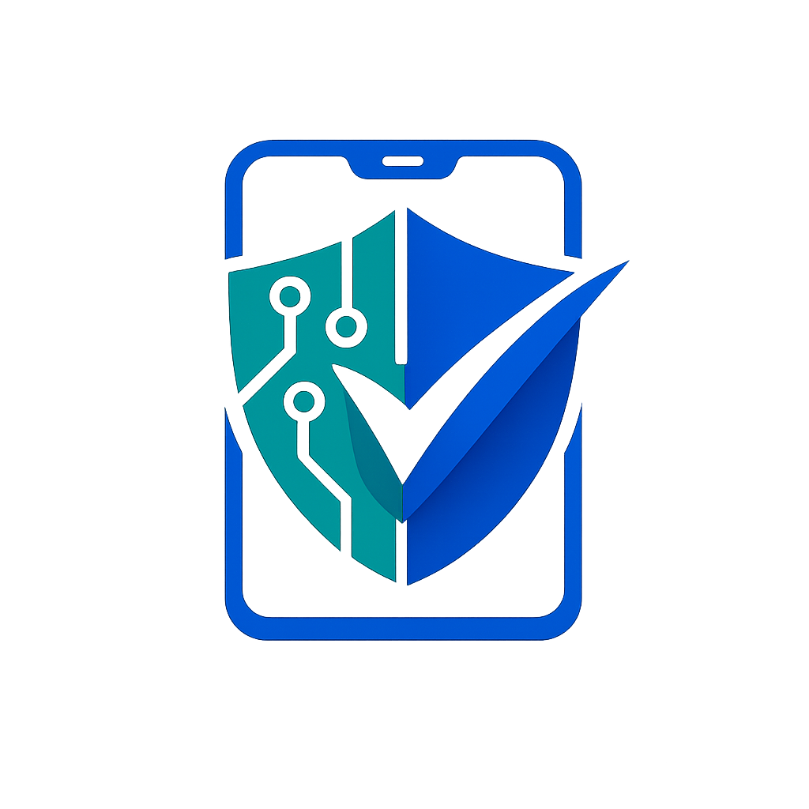

# OpenNEIR

  

**A Free and Open Source IMEI Verification Tool for Bangladesh NEIR**

---

## 📥 Download

Get the latest version of OpenNEIR from the **Releases** page.

| Channel | Version | Description | Link |
| :--- | :--- | :--- | :--- |
| **Stable** | v1.0.0 | Recommended for most users. Tested and reliable. | [**Download Latest Stable**](https://github.com/tas33n/openneir/releases/latest) |
| **Beta** | v1.0.0-beta | For early adopters. Contains new features but may have bugs. | [**View Beta Releases**](https://github.com/tas33n/openneir/releases) |

---

## 📖 Introduction

**OpenNEIR** is a privacy-focused, open-source mobile application designed to simplify the process of verifying mobile device registration status in Bangladesh. It interfaces with the National Equipment Identity Register (NEIR) system to provide users with instant details about their device's legal status.

Built with Flutter and powered by a secure Cloudflare Worker backend, OpenNEIR ensures your data is handled securely and transparently.

## ✨ Features

- **Instant IMEI Verification**: Check if your device is registered with BTRC's NEIR database.
- **Detailed Device Info**: Fetches Brand and Model information automatically (even for unregistered devices).
- **In-App Updater**:
    - Automatically checks for updates.
    - Supports both **Stable** and **Beta** release channels.
    - Android 14+ style update interface.
- **Secure Architecture**:
    - **End-to-End Encryption**: IMEI data is encrypted using AES-256-CBC before leaving your device.
    - **API Key Authentication**: Unauthorized access to the API is blocked.
    - **Privacy First**: No personal data is stored or logged.
- **Modern UI**:
    - Beautiful, adaptive Material 3 design.
    - Dark/Light mode support.
    - Smooth animations and haptic feedback.
- **Convenient Tools**:
    - Built-in Barcode/QR Scanner.
    - Auto-paste from clipboard.
    - Verification history.

## 🛠 Tech Stack

- **Frontend**: Flutter (Dart)
- **State Management**: Riverpod
- **Backend**: Cloudflare Workers (JavaScript)
- **Security**: Web Crypto API (AES-CBC), API Key Protection
- **Encryption**: `encrypt` package (Dart)

## ⚠️ Disclaimer

> [!IMPORTANT]
> **OpenNEIR is an Educational FOSS Project.**
>
> This application is **NOT** affiliated with, endorsed by, or connected to the Bangladesh Telecommunication Regulatory Commission (BTRC) or the official NEIR administration.
>
> - It is an independent, open-source initiative developed for educational and research purposes.
> - The app queries publicly available endpoints to retrieve status information.
> - Use this tool responsibly. The developers assume no liability for the accuracy of the data or any consequences arising from its use.

## 🚧 Source Code Availability

The source code for OpenNEIR will be released publicly.

Currently, the official NEIR database system is experiencing instability and frequent changes. To ensure the released codebase is reliable and accurate, we are waiting for these official systems to stabilize.

**Rest assured, this project is committed to being open source.** The code will be released for contribution as soon as the NEIR system updates are finalized. There is no specific ETA at this time.

## 🤝 Contributing

Contributions are welcome! This is a Free and Open Source Software (FOSS) project. Feel free to fork the repository, open issues, or submit pull requests.

## 💝 Support the Project

If you find this tool useful, consider supporting the development.

**Contact & Support**
 

